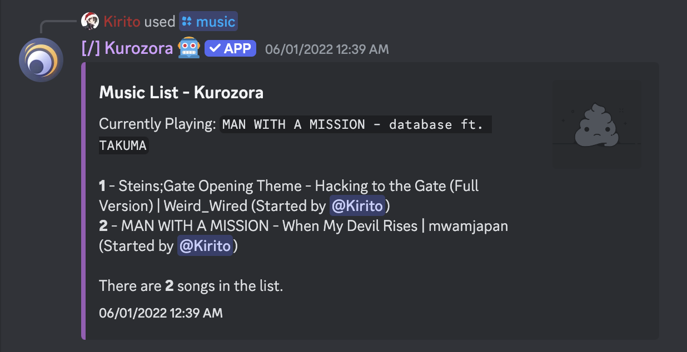

    <em>Unlimited access to a growing collection of over 90,000 anime, manga, music, games, and more!</em>

# Kurozora Discord Bot (KuroBot)   

[Kurozora](https://kurozora.app) is your one-stop shop for everything anime!
With Kurozora, you can easily search for anime, manga, games, music, characters, people, and studios from the biggest anime library in the world, Kurozora.app.

The fetched data is presented in a nice embed which includes titles, synopsis, poster/banner images, status, type, source, TV/age rating, genres, themes, broadcast/publication dates, seasons/volumes/editions, episodes/chapters, duration, ratings, and so forth.

But that’s not all. Kurozora is multipurpose and, among many stuff, allows you to quickly share anime GIFs, and search for anime music on YouTube, Spotify and Apple Music at the same time!

Full feature-list:

    Search
        anime
        manga
        game
        music
            YouTube, Spotify and Apple Music results combined
        characters
        people
        studios
    GIFs
        Anime
        Neko (Cat)
        Inu (Dog)
        Kitsu (Fox)
    Play anime music:
        Queue
        List queue
        Play/pause/clear
        Shuffle
        Loop
        Volume up/down
        Create stream links
    Create anime polls

# Screenshots

| Anime GIFs | Music Search | VC Queue | Character Search |
|------------|--------------|----------|------------------|
|  |  |  |  |

| Character Details | Anime Search | Anime Details |
|-------------------|--------------|---------------|
|  |  |  |

# Contributing

Read our [Contributing Guide](CONTRIBUTING.md) to learn about reporting issues, contributing code, and more ways to contribute.

# Security

Read our [Security Policy](SECURITY.md) to learn about reporting security issues.

# Getting in Touch

If you have any questions or just want to say hi, join the Kurozora [Discord](https://discord.gg/f3QFzGqsah) and drop a message on the #development channel.

# Code of Conduct

This project has a [Code of Conduct](CODE_OF_CONDUCT.md). By interacting with this repository, or community you agree to abide by its terms.

# More by Kurozora

- [Kurozora Android App](https://github.com/kurozora/kurozora-android) — Android client app
- [Kurozora iOS App](https://github.com/kurozora/kurozora-app) — iOS/iPadOS/MacOS client app
- [KurozoraKit](https://github.com/kurozora/KurozoraKit) — Simple to use framework for interacting with the Kurozora API
- [Kurozora Linux App](https://github.com/kurozora/kurozora-linux) — Linux client app
- [Kurozora Web](https://github.com/kurozora/kurozora-web) — Home to the Kurozora website and API
- [Kurozora Web Extension](https://github.com/Kurozora/kurozora-extension) — Anime, Manga and Game search engine for FireFox and Chrome

# License

KuroBot is an Open Source project covered by the [GNU General Public License v3.0](LICENSE).
