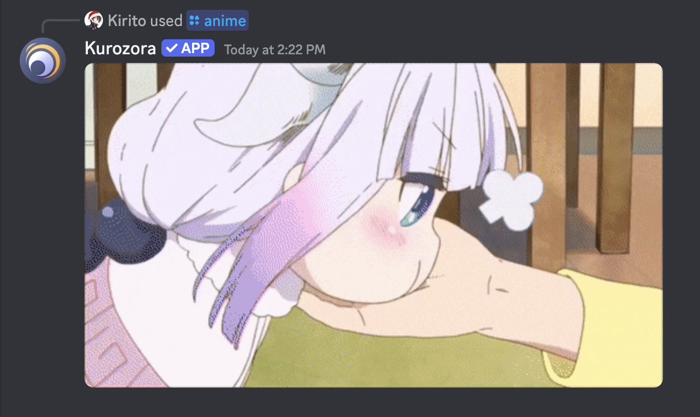

<p></p>

<p align="center"></p>

<p align="center">
    <sup><em>Unlimited access to a growing collection of over 90,000 anime, manga, music, games, and more!</em></sup>
</p>

# Kurozora Discord Bot (KuroBot) [](https://nodejs.org) [](https://discord.gg/f3QFzGqsah) [](LICENSE)

[Kurozora](https://kurozora.app) is your one-stop shop for everything anime!
With KuroBot, you can easily search for anime, manga, games, music, characters, people, and studios from the biggest anime library in the world—Kurozora.

The data is presented in nice embeds which include titles, synopsis, poster/banner images, status, type, source, TV/age rating, genres, themes, broadcast/publication dates, seasons/volumes/editions, episodes/chapters, duration, ratings, and more!

But that’s not all. Kurozora is multipurpose and, among many stuff, allows you to quickly share anime GIFs, and search for anime music on YouTube, Spotify and Apple Music at the same time!

Full feature-list:

- Search
    - anime
    - manga
    - game
    - music
        - YouTube, Spotify and Apple Music results combined
    - characters
    - people
    - studios
- GIFs
    - Anime
    - Neko (Cat)
    - Inu (Dog)
    - Kitsu (Fox)
- Play anime music:
    - Queue
    - List queue
    - Play/pause/clear
    - Shuffle
    - Loop
    - Volume up/down
- Create stream links
- Create anime polls
- Clear URLs from tracking parameters [^1]

[^1]: works only on the Kurozora server. Support can be extended if there's interest.

# Screenshots

| Anime GIFs | Music Search | VC Queue | Character Search |
|------------|--------------|----------|------------------|
|  |  |  |  |

| Character Details | Anime Search | Anime Details |
|-------------------|--------------|---------------|
|  |  |  |

# Getting Started

You can invite Kurozora Bot to your server from the [App Directory](https://discord.com/application-directory/954674154924294184). However, if you wish to run a local instance on your server, you can do so as well.

## Prerequisite

1. [NodeJS 20.x](https://nodejs.org)
2. [Python 3.x](https://python.org)
3. [PM2](https://pm2.keymetrics.io) (optional)

## Installation

Installing KuroBot is straightforward:

1. Clone the repository
    ```bash
    $ git clone https://github.com/Kurozora/kurozora-discord-bot.git
    ```
2. Navigate to the project directory
    ```bash
    $ cd kurozora-discord-bot
    ```
3. Install NPM and Python dependencies
    ```bash
    $ ./install
    ``` 

This last step in particular will install the dependencies necessary for KuroBot to work. It will also create a `.env` file where you need to specify secrets necessary for certain features to work.

## Setup

Although the app can run now, some functionality will not work without some setup.

### Discord Bot Account

For KuroBot to connect to your server, you will need to register it with Discord. Creating a bot account is done through the Discord Developers dashboard.

1. Log in on to the [developer dashboard](https://discord.com/developers)
2. Navigate to the [application page](https://discord.com/developers/applications)
3. Click on the `New Application` button
4. Give the application a name and click `Create`

### App Token

1. Navigate to the `Bot` tab to configure it
2. Copy the token using the `Copy` button
3. Open the `.env` file
4. Paste the copied token as the `TOKEN` key's value

### App ID

1. Navigate to the `General Information` tab
2. Copy the application ID using the `Copy` button
3. Open the `.env` file
4. Paste the copied ID as the `APP_ID` key's value

### Guild ID

1. Navigate to the Discord website or app
2. Right-click on your server
3. Select `Copy Server ID`
4. Open the `.env` file
5. Paste the copied ID as the `GUILD_ID` key's value

### Apple Music

When using the `/music search` command, Kurozora uses the Apple Music API to find songs on Apple Music. To get the necessary secrets for this feature to work, you need to be registered as an [Apple Developer](https://developer.apple.com).

After that, you need to generate a developer token. You can follow the steps on the [Apple Music documentation page](https://developer.apple.com/documentation/applemusicapi/generating_developer_tokens) to do so. Alternatively you can use tools such as [apple-music-token-generator](https://github.com/pelauimagineering/apple-music-token-generator) to make life easier.

Once the developer token is generated:

1. Open the `.env` file
2. Paste the copied token as the `AM_DEVELOPER_TOKEN` key's value
3. Add your team ID as the `AM_TEAM_ID` key's value
4. Add your key ID as the `AM_KEY_ID` key's value

### Spotify

Similar to Apple Music, the Spotify API is used for finding songs on Spotify. To get this to work, you need to be registered as a [Spotify Developer](https://developer.spotify.com).

After that you need to create an app to get the required ID and secret. You can follow the steps on the [Spotify documentation page](https://developer.spotify.com/documentation/web-api/tutorials/getting-started).

Once the credentials are generated:

1. Open the `.env` file
2. Paste the copied client ID as the `SPOTIFY_CLIENT_ID` key's value
3. Paste the copied client secret as the `SPOTIFY_CLIENT_SECRET` key's value

## Run

Use the following command to run KuroBot:

```bash
$ node index.js
```

While this is fine for testing purposes, quitting the process or closing the terminal will also terminate KuroBot. To keep KuroBot always running, you can use PM2 or other process managers.

1. Install PM2 as a global dependency
    ```bash
    $ npm install pm2 -g
    ```
2. Run KuroBot using PM2
    ```bash
    $ pm2 start index.js --update-env --name kuro-bot
    ```
3. Generate a startup script and follow the instructions in the terminal
    ```bash
    $ pm2 startup
    ```
4. Save the app list
    ```bash
    $ pm2 save
    ```

With this, PM2 should start KuroBot automatically on system (re)boot. PM2 will also restart the KuroBot process in case of crashes and other failures. You can learn more on the [PM2 documentation page](https://pm2.keymetrics.io/docs/usage/quick-start/).

# Contributing

Read our [Contributing Guide](CONTRIBUTING.md) to learn about reporting issues, contributing code, and more ways to contribute.

# Security

Read our [Security Policy](SECURITY.md) to learn about reporting security issues.

# Getting in Touch

If you have any questions or just want to say hi, join the Kurozora [Discord](https://discord.gg/f3QFzGqsah) and drop a message on the #development channel.

# Code of Conduct

This project has a [Code of Conduct](CODE_OF_CONDUCT.md). By interacting with this repository, or community you agree to abide by its terms.

# More by Kurozora

- [Kurozora Android App](https://github.com/kurozora/kurozora-android) — Android client app
- [Kurozora iOS App](https://github.com/kurozora/kurozora-app) — iOS/iPadOS/MacOS client app
- [KurozoraKit](https://github.com/kurozora/KurozoraKit) — Simple to use framework for interacting with the Kurozora API
- [Kurozora Linux App](https://github.com/kurozora/kurozora-linux) — Linux client app
- [Kurozora Web](https://github.com/kurozora/kurozora-web) — Home to the Kurozora website and API
- [Kurozora Web Extension](https://github.com/Kurozora/kurozora-extension) — Anime, Manga and Game search engine for FireFox and Chrome

# License

KuroBot is an Open Source project covered by the [GNU General Public License v3.0](LICENSE).
